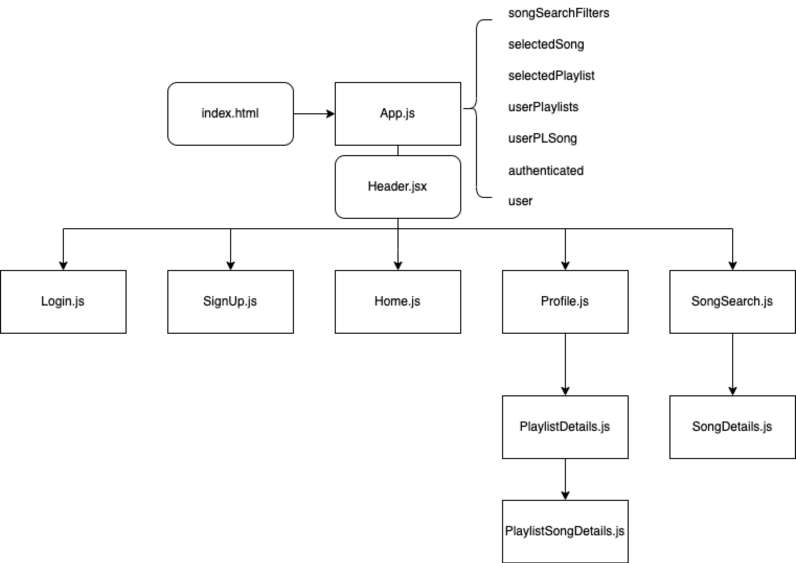
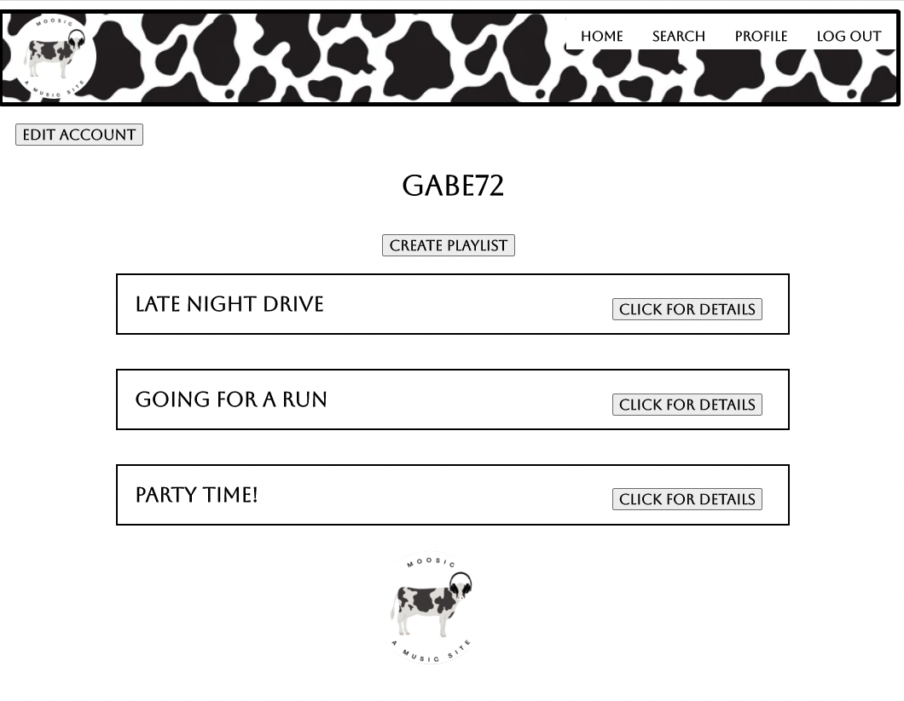

# Moosic

## Udderly Fantastic!

---

## Date: 8/10/2022 - 8/19/2022

---

###  Created By: Emily Byrne, Patrick Knight, Tommy Le

[Emily Byrne](https://www.linkedin.com/in/emilybyrne3/) | [Patrick Knight](https://www.linkedin.com/in/patrick-f-knight/) | [Tommy Le](https://www.linkedin.com/in/tommyyle/)

---
### **_Project Links_**

[Moosic Backend](https://github.com/Tommy-layy/moosic_backend) | [Trello](https://trello.com/b/t17RUM3i/moosic) | [Deployment](https://moosicfrontend.herokuapp.com/)

---

### **_Description_**

Moosic, a music app where users are able to browse for songs as well as create playlists where they can add their favorite songs! 

---

### **_Technologies_**

* PostgreSQL
* Express
* React
* Node
* Deployed using Heroku

---

### **_Screenshots_**

#### Component Hierarchy Diagram

#### Selected views of our website

---
### **_Getting Started_**

- `Fork` & `Clone` this repository.
- `npm i` to install necessary dependencies.

#### Dependencies include React, react-dom, react-router-dom, dotenv, axios, and sweetalert. These should already be in the package.json files, but will be good to make sure. Please make sure that your local machine has the proper installations for these, as well.

#### Remember that this repo is only the frontend portion of the Moosic project. The backend portion is availabla via the link provided above.

---

### **_Future Updates_**

- [x] ~~Authentication required to view certain content~~
- [x] ~~Use a 3rd party API to get songs~~
- [ ] Optimize for mobile experience
- [ ] Users can rate songs
- [ ] Users can find and connect to other users
- [ ] User can post messages to each other/in a forum

---

### **_Credits_**

#### Created as a part of the General Assembly - SEI program.

* www.freecodecamp.org for 'PERN' logo
* [Rapid API](https://rapidapi.com/?site) with [Spotify](https://open.spotify.com/) for 3rd party API
* Deployed with [heroku](https://www.heroku.com/)
